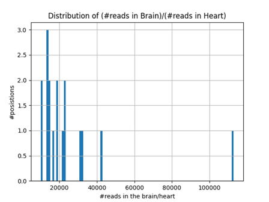
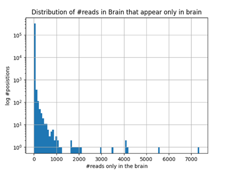

# Final Project - Exploring Genetic Candidates for Self-Avoidance in Cyclostome Neural Systems

**Adi Monina**  
**Dr. Rotem Rubenstein Lab**  
**Tel-Aviv University**

---

## Introduction
Neuronal self-avoidance is a mechanism where a neuron's own axons and dendrites repel each other, while allowing interactions with those from other neurons. In various organisms, proteins such as DCAM and cPcdhs mediate this process, though the specific mechanisms in cyclostomes remain unexplored.
This study explores potential genetic candidates involved in self-avoidance mechanisms in Japanese lamprey (Lethenteron japonicum), focusing on genes with similar attributes to the known Dscamand clustered Protocadherins (cPcdhs). 
## Setup

### Downloads

#### Gene Candidates from Annotated Data
- Download the Japanese lamprey genome from Ensembl: [**Lamprey Genome**](https://www.ensembl.org/Petromyzon_marinus/Info/Index)
- Obtain Gene Ontology (GO) terms for Dscam from AmiGO: [**Dscam GO Terms**](https://amigo.geneontology.org/amigo/search/annotation?q=dscam)

#### Gene Candidates from Unannotated Data
- Download the DNA sequence from Ensembl: [**Lamprey Genome**](https://www.ensembl.org/Petromyzon_marinus/Info/Index)
- Download RNA sequences from ENA:  
  - **Heart, juvenile, female**: [**SAMEA10418721**](https://www.ebi.ac.uk/ena/browser/view/SAMEA10418721), [**SAMEA10418729**](https://www.ebi.ac.uk/ena/browser/view/SAMEA10418729)
  - **Brain, juvenile, female**: [**SAMEA10418709**](https://www.ebi.ac.uk/ena/browser/view/SAMEA10418709), [**SAMEA10418711**](https://www.ebi.ac.uk/ena/browser/view/SAMEA10418711)

### Installation of Required Tools

#### For Unannotated Data Analysis
- Install **Quast** for DNA quality assessment: [**Quast**](https://quast.sourceforge.net/docs/manual.html#sec1)
- Install **FastQC** for RNA quality assessment: [**FastQC**](https://www.bioinformatics.babraham.ac.uk/projects/download.html#fastqc)
- Install **Trimmomatic** to improve RNA quality: [**Trimmomatic**](https://github.com/usadellab/Trimmomatic?tab=readme-ov-file#installation)
- Install **STAR** for sequence mapping: [**STAR**](https://github.com/alexdobin/STAR?tab=readme-ov-file#compiling-from-source)
- Install **QualiMap** for mapping quality analysis: [**QualiMap**](http://qualimap.conesalab.org/doc_html/intro.html#installation)

### Clone This Repository
```bash
git clone https://github.com/adimonina/Cyclostome-Self-Avoidance.git
```

## Running the Analysis

#### For Annotated Data
Run the analysis script:
```bash
./Gene_candidates_based_on_annotated_data/analysis.sh
```

#### For Unannotated Data
To run the full pipeline, execute the scripts in this order:
```bash
./Gene_candidates_based_on_unannotated_data/data.sh
./Gene_candidates_based_on_unannotated_data/mapping.sh
./Gene_candidates_based_on_unannotated_data/analysis.sh
```

## Results

### Gene Candidates from Annotated Data
The list of 15 candidate genes identified is available [here](resources/list_of_candidate_genes.txt).

### Gene Candidates from Unannotated Data
Mapping results yielded graphs showing read distributions for brain and heart samples, indicating gene expression patterns.

- **Overlap Full Range**: For genes expressed in both brain and heart, a high ratio indicates more reads in the brain.  
  

- **Only Brain Full Range**: For genes expressed solely in the brain, the count distribution includes both high and low reads.  
  
